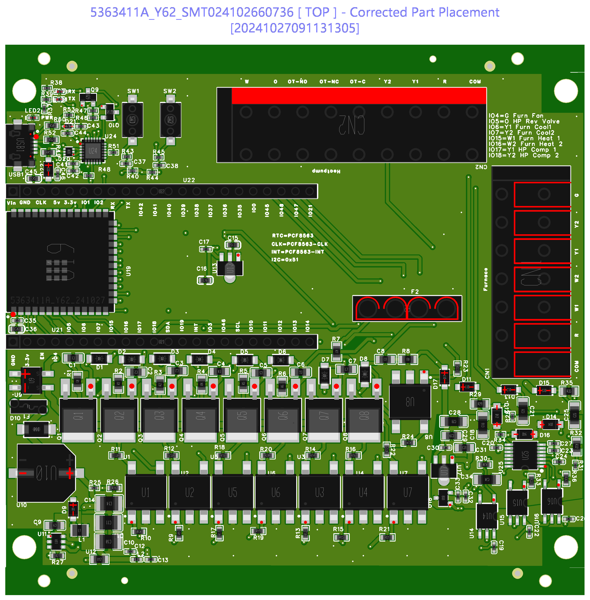
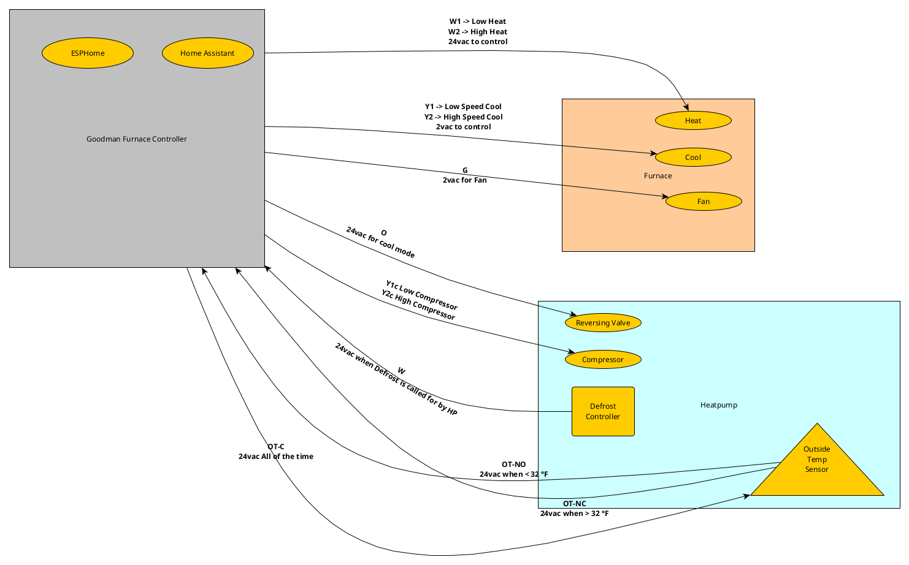

# ESPHome Goodman Funace Controller
## Why?
Actually, it was way crazy but working from home I am sick of hearing the old controller relays. This board uses triacs to accomplish what the old relays did. ODC much anyway I learned so much with this board so I also wanted to share and keep for prosperity. Also, maybe someone will find this interesting or useful in other endeavors related to climate controls.  
## Info
 This is the current ESPHome code and support for my Goodman Furnace Controller. 
 I have a blog on this [here](https://alshowto.com/esp32-s3-climatefurnace-controller/)
 
 
## Use Diagram

## Key Attributes
|Device|Description|Other Info
|------|-----------|--------
|Furnace Controller| Uses ESPHome to interact a ESP32 S3 uController to Home Assistant using ESPHome Climate Component that has also completly replaced my Goodman heatpump control board.
|Heatpump| Standard goodman heatpump that resides outdoors.
|Furnace| High efficiency furnace with 2 stages for cool(Fan Speed) and 2 stages of gas heat burner control

|Label|Description|Other Info
|------|---------|--------
|Furnance| Furnace outputs and inputs| smaller of the two connectors
|R|24vac output from furnace| Typically also R inside furnace
|COM|Common neutral wire| **Note: this may be bonded to furnace metal!  DO NOT!!! let controller board come in contact with any metal on the furnace or it will blow the fuses and who knows what else!** You have been warned!!!
|G| Fan Control| 24vac turns on the fan.
|Y1| Low Cool Control| 24vac turns on low cool mode. **Y1 in version 1 controls both Heatpump and Furnace Y1** with my configuration it was not needed to worry about control of HP Y1 or compressor vs furnace Y1 in later versions I separated Y1 just like I did for Y2 so that will be a firmware update once I get the newer contoller boards from JLPCB.
|Y2| High Cool Control| 24vac turns on high cool mode.
|W1| Low Heat Control| Turns on low gas valve and low heat fan speed.
|W2| High Heat Control| Turns on high gas valve and high heat fan speed.
|Heatpump|Larger of the spring terminals marked with heatpump
|COM|Same as furnace COM|Neutral to heatpump
|R|24vac always supplied to heatpump|This goes through the 3 amp F2 fuse on controller.
|Y1|Compressor Low Control| 24vac when low cool or low heat is called for by controller. My heatpump only has single speed compressor so this is what I use. **Shared with Y1 to furnace in V1** see note in furnace section above.
|Y2|Compressor High Control| 24vac when high cool or high heat is called for by controller.| Never really tested this as my heatpump only is single stage.
|OT-C|24vac all of the time| This is all supplied by furnace.
|OT-NC|24vac is here when temp is > 32 °F|Note 32 ° is just an estimate of what to use your temp may be different. That is the purpose of the external temp sensor on the HP based on thermal efficiency. If no external device than some other means could be applied to generate the voltage here even dc should work if you know what you are doing. In my case, I have a sensor for this from [here](https://iwae.com/media/manuals/goodman/ot18-60a-installation.pdf).  
|OT-NO|24ac is here when temp is < 32 °F|Not really needed but I added it because there was a wire from the heatpump that is live and I did not want it just floating around with potential to short out. Could be useful in diagnostic sense maybe.
|O|Reversing valve|24vac here when reversing valve is to be on. In my case that is on when heatpump in cool mode. This is what the heatpump uses to switch from heat to cool mode and modifies the way the freon flows through the system. Not getting into thermodynamics here but this is how it pulls heat from outside in winter and pulls heat from inside in summer.
|W|Defrost call| 24vac here when heatpump defrost controller calls for low heat from furnace to perform defrost. Again this is a complex task as it causes the heatpump to transfer over to cool mode and uses heat from the furnace to defost the outside coils. My heatpump has a built in defrost controller that watches the runtime of the heatpump in heating mode and request defrost every 30 minutes of runtime. Your system may be different and you need to do research into this based on your heatpump and furnace combo.

## Other info
- [Here](https://alshowto.com/home-assistant-and-esphome-how-to-series-1-step-4-centrally-controlled-thermostat/) is my older post on this subject.
- The original Goodman AFE18-60A control board for Heatpumps [pdf}(https://totalairsupply.com/wp-content/uploads/2020/10/Goodman_AFE18-60A_Dual_Fuel_Control_IO_Manual_9-06.pdf). This is where I got much of my info on how to build this board.
- The temp senor as originally installed on system is [here](https://iwae.com/media/manuals/goodman/ot18-60a-installation.pdf).
- More info on furnace [wires](https://cielowigle.com/blog/thermostat-wiring/).
- My latest post [here](https://alshowto.com/esp32-s3-climatefurnace-controller/).
- More to come in the next few weeks as I finalize my boards and schematics in [EasyEDA](https://easyeda.com/).

